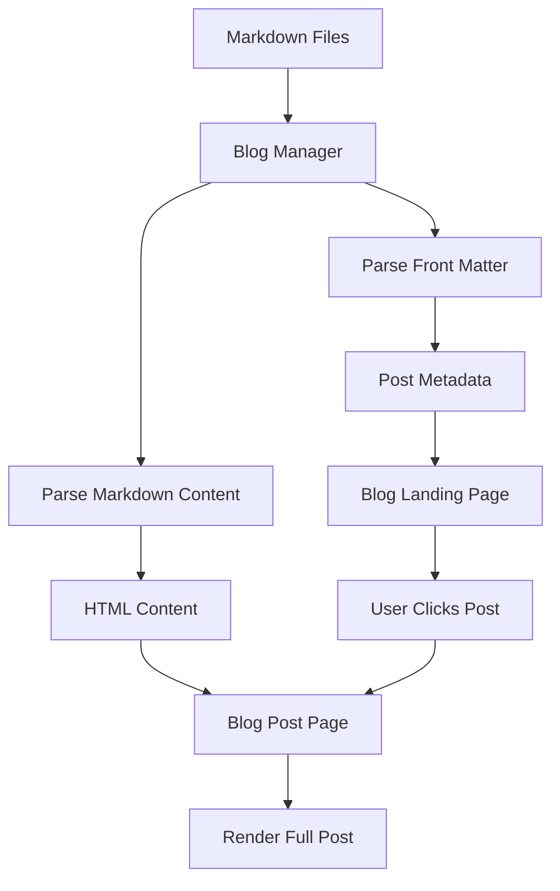

# Blog Section Design Document

## Overview

The blog section will be a content-focused addition to the Eric Savoie portfolio website, designed to share app development experiences, technical learnings, and project updates. The design follows the existing warm color palette and component architecture while introducing blog-specific patterns for content presentation and navigation.

The blog will be built as a static site using markdown files for content, with a simple JavaScript-based rendering system that maintains the site's current lightweight, GitHub Pages-compatible approach. The design prioritizes readability, visual consistency with the existing site, and ease of content management.

## Architecture

### High-Level Structure

```
ericsavoie119.github.io/
├── blog/
│   ├── index.html                 # Blog landing page
│   ├── posts/
│   │   ├── 2025-01-15-learning-swiftui.md
│   │   ├── 2025-01-20-curiosityai-launch.md
│   │   └── [future-posts].md
│   └── assets/
│       └── post-images/
│           ├── learning-swiftui/
│           └── curiosityai-launch/
├── assets/
│   ├── css/
│   │   ├── components/
│   │   │   ├── _blog-card.css      # Blog post card styling
│   │   │   ├── _blog-post.css      # Individual post styling
│   │   │   └── _blog-filters.css   # Tag filtering UI
│   │   └── pages/
│   │       ├── _blog-landing.css   # Blog landing page
│   │       └── _blog-detail.css    # Blog post detail page
│   └── js/
│       ├── components/
│       │   ├── blog-manager.js     # Blog post loading & rendering
│       │   ├── markdown-parser.js  # Markdown to HTML conversion
│       │   └── blog-filters.js     # Tag filtering logic
│       └── utils/
│           └── reading-time.js     # Calculate reading time
```

### Data Flow



## Components and Interfaces

### 1. Blog Post Card Component

**Purpose**: Display blog post preview on the landing page

**HTML Structure**:
```html
<article class="blog-card">
  <div class="blog-card__image">
    
    <div class="blog-card__date">Jan 15, 2025</div>
  </div>
  <div class="blog-card__content">
    <div class="blog-card__tags">
      <span class="tag">SwiftUI</span>
      <span class="tag">Learning</span>
    </div>
    <h3 class="blog-card__title">Learning SwiftUI: My First Month</h3>
    <p class="blog-card__excerpt">
      After diving into SwiftUI for my latest app project...
    </p>
    <div class="blog-card__meta">
      <span class="blog-card__reading-time">5 min read</span>
    </div>
  </div>
</article>
```

**CSS Styling**:
- Inherits card styling from existing `.card` component
- Featured image with overlay for date badge
- Hover effect: lift and shadow increase (consistent with app cards)
- Responsive: full width on mobile, grid layout on desktop

### 2. Blog Post Page Component

**Purpose**: Display full blog post with formatted content

**HTML Structure**:
```html
<article class="blog-post">
  <header class="blog-post__header">
    <div class="blog-post__meta">
      <time datetime="2025-01-15">January 15, 2025</time>
      <span class="blog-post__reading-time">5 min read</span>
    </div>
    <h1 class="blog-post__title">Learning SwiftUI: My First Month</h1>
    <div class="blog-post__tags">
      <a href="#" class="tag">SwiftUI</a>
      <a href="#" class="tag">Learning</a>
    </div>
  </header>
  
  <div class="blog-post__featured-image">
    
  </div>
  
  <div class="blog-post__content">
    <!-- Rendered markdown content -->
  </div>
  
  <footer class="blog-post__footer">
    <div class="blog-post__navigation">
      <a href="/blog" class="btn btn--secondary">← Back to Blog</a>
    </div>
    <div class="blog-post__related">
      <h3>Related Posts</h3>
      <!-- Related post cards -->
    </div>
  </footer>
</article>
```

**Content Styling**:
- Max width: 800px for optimal readability
- Typography: larger base font (18px), increased line height (1.7)
- Headings: clear hierarchy with proper spacing
- Code blocks: syntax highlighting with Prism.js or Highlight.js
- Images: responsive, centered, with captions
- Links: underlined in content, using accent color
- Blockquotes: left border accent, italic text

### 3. Blog Landing Page Component

**Purpose**: Main blog page with post listing and filtering

**HTML Structure**:
```html
<section class="blog-landing">
  <div class="container">
    <header class="blog-landing__header">
      <h1 class="section-title">Blog</h1>
      <p class="section-subtitle">
        Thoughts on app development, lessons learned, and project updates
      </p>
    </header>
    
    <div class="blog-filters">
      <button class="blog-filter blog-filter--active" data-tag="all">
        All Posts
      </button>
      <button class="blog-filter" data-tag="swiftui">SwiftUI</button>
      <button class="blog-filter" data-tag="aws">AWS</button>
      <button class="blog-filter" data-tag="launch">Launch</button>
    </div>
    
    <div class="blog-grid" id="blog-posts">
      <!-- Blog cards dynamically inserted -->
    </div>
    
    <div class="blog-pagination">
      <button class="btn btn--secondary" id="load-more">Load More</button>
    </div>
  </div>
</section>
```

### 4. Blog Manager (JavaScript)

**Purpose**: Load, parse, and render blog posts

**Interface**:
```javascript
class BlogManager {
  constructor(config) {
    this.postsDirectory = config.postsDirectory;
    this.posts = [];
    this.filteredPosts = [];
    this.currentPage = 1;
    this.postsPerPage = 9;
  }
  
  async loadPosts() {
    // Fetch post list from posts-manifest.json
    // Parse markdown files
    // Sort by date (newest first)
  }
  
  renderPostList(container, posts) {
    // Render blog cards to container
  }
  
  renderPost(slug) {
    // Render full blog post
  }
  
  filterByTag(tag) {
    // Filter posts by tag
  }
  
  calculateReadingTime(content) {
    // Calculate estimated reading time
  }
  
  parseMarkdown(markdown) {
    // Convert markdown to HTML
  }
  
  parseFrontMatter(content) {
    // Extract YAML front matter
  }
}
```

### 5. Markdown Parser

**Purpose**: Convert markdown to HTML with syntax highlighting

**Dependencies**: 
- marked.js (lightweight markdown parser)
- highlight.js (syntax highlighting for code blocks)

**Configuration**:
```javascript
const marked = require('marked');
const hljs = require('highlight.js');

marked.setOptions({
  highlight: function(code, lang) {
    if (lang && hljs.getLanguage(lang)) {
      return hljs.highlight(code, { language: lang }).value;
    }
    return hljs.highlightAuto(code).value;
  },
  breaks: true,
  gfm: true
});
```

## Data Models

### Blog Post Front Matter

Each markdown file will include YAML front matter with metadata:

```yaml
---
title: "Learning SwiftUI: My First Month"
date: 2025-01-15
excerpt: "After diving into SwiftUI for my latest app project, here are the key lessons I learned in my first month."
featuredImage: "/blog/assets/post-images/learning-swiftui/hero.jpg"
tags:
  - SwiftUI
  - Learning
  - iOS Development
author: Eric Savoie
readingTime: 5
published: true
---
```

### Posts Manifest

A JSON file listing all posts for efficient loading:

```json
{
  "posts": [
    {
      "slug": "learning-swiftui",
      "title": "Learning SwiftUI: My First Month",
      "date": "2025-01-15",
      "excerpt": "After diving into SwiftUI...",
      "featuredImage": "/blog/assets/post-images/learning-swiftui/hero.jpg",
      "tags": ["SwiftUI", "Learning", "iOS Development"],
      "readingTime": 5,
      "published": true
    }
  ]
}
```

This manifest will be manually updated when adding new posts (or generated via a build script).

### Post URL Structure

- Landing page: `/blog/` or `/blog/index.html`
- Individual posts: `/blog/posts/learning-swiftui.html`
- Tag filtering: `/blog/?tag=swiftui` (client-side filtering)

## Error Handling

### Missing Posts
- **Scenario**: User navigates to non-existent post URL
- **Handling**: Display 404-style message with link back to blog landing
- **Implementation**: Check if post exists in manifest before rendering

### Failed Image Loading
- **Scenario**: Featured image fails to load
- **Handling**: Display placeholder gradient background (matching site colors)
- **Implementation**: Use `onerror` handler on images

### Markdown Parsing Errors
- **Scenario**: Malformed markdown content
- **Handling**: Log error to console, display raw content with warning
- **Implementation**: Try-catch around markdown parsing

### Empty Blog State
- **Scenario**: No posts published yet
- **Handling**: Display friendly message: "No posts yet. Check back soon!"
- **Implementation**: Check posts array length before rendering

### Tag Filtering No Results
- **Scenario**: User filters by tag with no matching posts
- **Handling**: Display message: "No posts found with this tag. View all posts."
- **Implementation**: Check filtered array length

## Testing Strategy

### Unit Tests
- **Markdown Parser**: Test various markdown syntax (headings, lists, code blocks, links)
- **Front Matter Parser**: Test YAML parsing with different metadata combinations
- **Reading Time Calculator**: Test with various content lengths
- **Tag Filtering**: Test filtering logic with multiple tags

### Integration Tests
- **Blog Manager**: Test full post loading and rendering flow
- **Navigation**: Test links between landing page and post pages
- **Responsive Design**: Test layout at different breakpoints

### Manual Testing Checklist
- [ ] Blog landing page loads and displays posts
- [ ] Clicking post card navigates to full post
- [ ] Tag filtering works correctly
- [ ] "Load More" pagination functions
- [ ] Back to blog navigation works
- [ ] Images load correctly with lazy loading
- [ ] Code syntax highlighting displays properly
- [ ] Mobile responsive layout works
- [ ] Keyboard navigation functions
- [ ] Screen reader announces content correctly

### Performance Testing
- **Metrics to Track**:
  - Page load time (target: < 2s)
  - Time to interactive (target: < 3s)
  - Largest Contentful Paint (target: < 2.5s)
  - Cumulative Layout Shift (target: < 0.1)

- **Tools**:
  - Lighthouse CI for automated performance checks
  - WebPageTest for detailed analysis
  - Chrome DevTools for profiling

### Accessibility Testing
- **Tools**:
  - axe DevTools for automated accessibility checks
  - WAVE browser extension
  - Screen reader testing (VoiceOver on macOS)

- **Checklist**:
  - [ ] Proper heading hierarchy (h1 → h2 → h3)
  - [ ] Alt text for all images
  - [ ] ARIA labels where needed
  - [ ] Keyboard navigation support
  - [ ] Color contrast meets WCAG AA standards
  - [ ] Focus indicators visible

## Visual Design Specifications

### Color Palette (from existing design system)

**Primary Colors**:
- Primary Orange-Red: `#ff3c00` (Heart Orange)
- Structural Brown: `#431a00`
- Warm Orange: `#e6915c`
- Peachy Pink: `#ffb8a3`

**Background Colors**:
- Page Background: `#487eb0` (blue from inline styles)
- Section Background: `#273c75`
- Hero Background: `#192a56`
- Card Background: `#487eb0`
- Surface: `#ffffff`

**Text Colors**:
- Primary Text: `#f5f6fa`
- Muted Text: `#f5f6fa` with reduced opacity
- Link Color: `#00a8ff`
- Link Hover: `#e63600`

### Typography

**Font Family**: 
- Primary: `-apple-system, BlinkMacSystemFont, 'Segoe UI', Roboto, sans-serif`
- Code: `'SF Mono', Consolas, 'Liberation Mono', Menlo, Courier, monospace`

**Blog Post Content Typography**:
- Body: 18px / 1.7 line height
- H1: 3rem (48px), bold
- H2: 2rem (32px), semibold
- H3: 1.5rem (24px), semibold
- H4: 1.25rem (20px), medium
- Code inline: 16px, monospace
- Code block: 14px, monospace

### Spacing

**Blog Card**:
- Padding: 2rem (32px)
- Gap between cards: 2rem (32px)
- Image height: 200px

**Blog Post**:
- Content max-width: 800px
- Content padding: 2rem (mobile), 3rem (desktop)
- Paragraph spacing: 1.5rem
- Heading spacing: 2.5rem top, 1rem bottom

### Responsive Breakpoints

- Mobile: < 768px (1 column)
- Tablet: 768px - 1024px (2 columns)
- Desktop: > 1024px (3 columns)

### Animations

**Blog Card Hover**:
```css
.blog-card:hover {
  transform: translateY(-6px);
  box-shadow: 0 20px 25px rgba(0, 0, 0, 0.15);
  transition: all 250ms cubic-bezier(0.33, 1, 0.68, 1);
}
```

**Page Transitions**:
- Fade in: 350ms ease-out
- Slide up: 350ms cubic-bezier(0.33, 1, 0.68, 1)

## SEO Optimization

### Meta Tags Template

```html
<head>
  <title>Learning SwiftUI: My First Month | Eric Savoie Blog</title>
  <meta name="description" content="After diving into SwiftUI for my latest app project, here are the key lessons I learned in my first month.">
  <meta name="keywords" content="SwiftUI, iOS Development, Learning, Eric Savoie">
  
  <!-- Open Graph -->
  <meta property="og:type" content="article">
  <meta property="og:title" content="Learning SwiftUI: My First Month">
  <meta property="og:description" content="After diving into SwiftUI...">
  <meta property="og:image" content="https://ericsavoie.com/blog/assets/post-images/learning-swiftui/hero.jpg">
  <meta property="og:url" content="https://ericsavoie.com/blog/posts/learning-swiftui.html">
  <meta property="article:published_time" content="2025-01-15T00:00:00Z">
  <meta property="article:author" content="Eric Savoie">
  <meta property="article:tag" content="SwiftUI">
  
  <!-- Twitter Card -->
  <meta name="twitter:card" content="summary_large_image">
  <meta name="twitter:title" content="Learning SwiftUI: My First Month">
  <meta name="twitter:description" content="After diving into SwiftUI...">
  <meta name="twitter:image" content="https://ericsavoie.com/blog/assets/post-images/learning-swiftui/hero.jpg">
  
  <!-- Canonical URL -->
  <link rel="canonical" href="https://ericsavoie.com/blog/posts/learning-swiftui.html">
</head>
```

### Structured Data (JSON-LD)

```json
{
  "@context": "https://schema.org",
  "@type": "BlogPosting",
  "headline": "Learning SwiftUI: My First Month",
  "description": "After diving into SwiftUI for my latest app project...",
  "image": "https://ericsavoie.com/blog/assets/post-images/learning-swiftui/hero.jpg",
  "datePublished": "2025-01-15T00:00:00Z",
  "dateModified": "2025-01-15T00:00:00Z",
  "author": {
    "@type": "Person",
    "name": "Eric Savoie",
    "url": "https://ericsavoie.com"
  },
  "publisher": {
    "@type": "Person",
    "name": "Eric Savoie"
  },
  "mainEntityOfPage": {
    "@type": "WebPage",
    "@id": "https://ericsavoie.com/blog/posts/learning-swiftui.html"
  }
}
```

### URL Structure

- Clean, descriptive URLs
- Include keywords in slug
- Use hyphens for word separation
- Keep URLs short and readable

**Examples**:
- `/blog/learning-swiftui`
- `/blog/curiosityai-launch-retrospective`
- `/blog/aws-lambda-tips`

## Performance Optimization

### Image Optimization
- Compress images to < 200KB
- Use WebP format with JPEG fallback
- Implement lazy loading for below-fold images
- Provide responsive image sizes

### Code Splitting
- Load markdown parser only on blog pages
- Load syntax highlighter only when code blocks present
- Defer non-critical JavaScript

### Caching Strategy
- Cache blog posts in localStorage (optional enhancement)
- Set appropriate cache headers for static assets
- Use service worker for offline support (future enhancement)

### Critical CSS
- Inline critical CSS for above-the-fold content
- Defer loading of blog-specific CSS on non-blog pages

## Accessibility Features

### Semantic HTML
- Use `<article>` for blog posts
- Use `<time>` for dates with datetime attribute
- Use proper heading hierarchy
- Use `<nav>` for blog navigation

### ARIA Labels
```html
<nav aria-label="Blog navigation">
  <a href="/blog" aria-label="Return to blog home">← Back to Blog</a>
</nav>

<div class="blog-filters" role="group" aria-label="Filter posts by tag">
  <button aria-pressed="true">All Posts</button>
  <button aria-pressed="false">SwiftUI</button>
</div>
```

### Keyboard Navigation
- All interactive elements focusable
- Visible focus indicators
- Skip to content link
- Logical tab order

### Screen Reader Support
- Descriptive link text (avoid "click here")
- Alt text for all images
- ARIA live regions for dynamic content updates

## Future Enhancements

### Phase 2 Features
- RSS feed generation
- Search functionality (client-side with Fuse.js)
- Comments system (Disqus or utterances)
- Social sharing buttons
- Newsletter subscription

### Phase 3 Features
- Related posts algorithm
- Post series/collections
- Author bio section
- Table of contents for long posts
- Dark mode toggle

### Phase 4 Features
- Full-text search with backend
- Analytics dashboard
- Content recommendations
- Progressive Web App features
- Offline reading support
