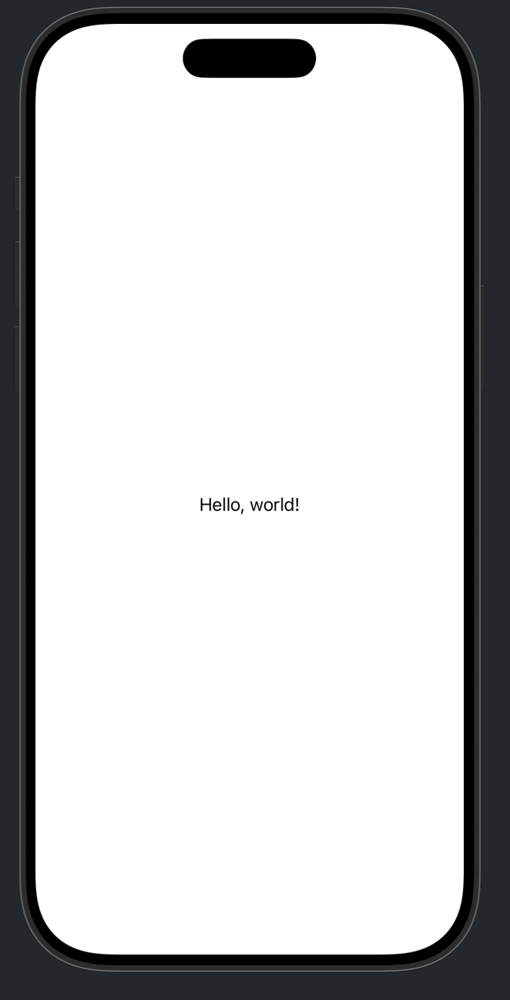
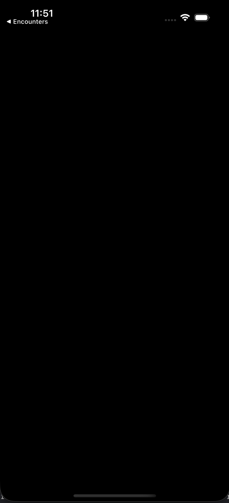
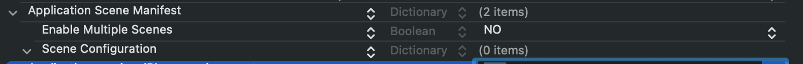

# How does SwiftUI call UIKit?

_Look Under the Hood, part 1_

I learned modern iOS development through SwiftUI. That makes UIKit feel slightly backwards: most explanations start with UIKit and use SwiftUI as the comparison, while I need the map to work in the other direction.

The most fun way to do this looks to me like rebuilding familiar SwiftUI ideas in UIKit, then looking underneath both frameworks to understand what the system is actually doing.

For our first step, we will take the smallest useful SwiftUI app—a “Hello, world!” then try to figure out whats going on under the hood.

## What we are building

Here is the SwiftUI app:

```swift
import SwiftUI

@main
struct HelloWorldApp: App {
    var body: some Scene {
        WindowGroup {
            ContentView()
        }
    }
}

struct ContentView: View {
    var body: some View {
        Text("Hello, world!")
    }
}
```

The goal here is to see what SwiftUI is abstracting away from, how and where it uses UIKit and then display the same view in both frameworks.

Before changing anything, run the SwiftUI version once. Select the app's scheme and an iPhone simulator, then press `⌘R`.



We will build the same visible result using UIKit:

```text
main.swift
  → UIApplicationMain
    → AppDelegate
      → SceneDelegate
        → UIWindow
          → UIViewController
            → UILabel
```

## Step 1: What does `@main` actually do?

`@main` is a Swift language feature, not a SwiftUI feature. It marks one type as the program's entry point.

The marked type must provide a static `main()` method. We do not write that method on `HelloWorldApp`; the `App` protocol supplies it for us. Conceptually, Swift turns this:

```swift
@main
struct HelloWorldApp: App {
    // ...
}
```

into something like:

```swift
HelloWorldApp.main()
```

This is the first layer SwiftUI hides: our `App` conformer is not merely a container for `body`. It also participates in starting the process.

You can read the swift evolution proposal here if you're curious: [SE-0281: `@main`](https://github.com/swiftlang/swift-evolution/blob/main/proposals/0281-main-attribute.md).

## Step 2: Recreating SwiftUI Hello World in UIKit

For this exercise, stay in the same Xcode project. We are going to replace SwiftUI with UIKit.

Add a file named `main.swift`.

```swift
import UIKit

UIApplicationMain(
    CommandLine.argc,
    CommandLine.unsafeArgv,
    nil,
    NSStringFromClass(AppDelegate.self)
)
```

`UIApplicationMain` starts the UIKit application and its main event loop. Its four arguments are easier to read when we name them:

```swift
UIApplicationMain(
    argumentCount,
    argumentValues,
    principalClassName,
    delegateClassName
)
```

- `CommandLine.argc` is the number of command-line arguments.
- `CommandLine.unsafeArgv` contains those arguments.
- Passing `nil` for the principal class tells UIKit to use `UIApplication`.
- The final argument names the app delegate class UIKit should create.

Most app code never needs the first two values. The important relationship is:

```text
UIApplication ↔ AppDelegate
```

There is one application object for the process. The app delegate handles process-wide setup and events.

> **First error:** `Cannot find 'AppDelegate' in scope`
>
> That is expected: `main.swift` names an app delegate that we have not created yet. The compiler has shown us the next piece of the launch path.

## Step 3: Add the app delegate

Create `AppDelegate.swift`:

```swift
import UIKit

final class AppDelegate: NSObject, UIApplicationDelegate {
    func application(
        _ application: UIApplication,
        didFinishLaunchingWithOptions launchOptions: [
            UIApplication.LaunchOptionsKey: Any
        ]? = nil
    ) -> Bool {
        true
    }

    func application(
        _ application: UIApplication,
        configurationForConnecting connectingSceneSession: UISceneSession,
        options: UIScene.ConnectionOptions
    ) -> UISceneConfiguration {
        let configuration = UISceneConfiguration(
            name: "Default Configuration",
            sessionRole: connectingSceneSession.role
        )
        configuration.delegateClass = SceneDelegate.self
        return configuration
    }
}
```

Why inherit from `NSObject`? `UIApplicationDelegate` inherits from `NSObjectProtocol`. Inheriting from `NSObject` gives our class the Objective-C runtime behaviour that UIKit expects and satisfies that protocol relationship.

The two methods have different jobs:

- `didFinishLaunchingWithOptions` finishes process-level setup.
- `configurationForConnecting` tells UIKit how to configure a new scene.

This distinction matters. In a scene-based app, the app delegate launches the process; a scene delegate builds each instance of the interface.

> **Second error:** `Cannot find 'SceneDelegate' in scope`
>
> `AppDelegate` now exists, but it asks UIKit to use a scene delegate that does not exist yet. That gives us our next file.

## Step 4: Build the scene

Create `SceneDelegate.swift`:

```swift
import UIKit

final class SceneDelegate: UIResponder, UIWindowSceneDelegate {
    var window: UIWindow?

    func scene(
        _ scene: UIScene,
        willConnectTo session: UISceneSession,
        options connectionOptions: UIScene.ConnectionOptions
    ) {
        guard let windowScene = scene as? UIWindowScene else {
            return
        }

        let rootViewController = UIViewController()
        rootViewController.view.backgroundColor = .systemBackground

        let helloWorldLabel = UILabel()
        helloWorldLabel.text = "Hello, world!"
        helloWorldLabel.translatesAutoresizingMaskIntoConstraints = false

        rootViewController.view.addSubview(helloWorldLabel)

        NSLayoutConstraint.activate([
            helloWorldLabel.centerXAnchor.constraint(
                equalTo: rootViewController.view.centerXAnchor
            ),
            helloWorldLabel.centerYAnchor.constraint(
                equalTo: rootViewController.view.centerYAnchor
            ),
        ])

        let window = UIWindow(windowScene: windowScene)
        window.rootViewController = rootViewController
        self.window = window
        window.makeKeyAndVisible()
    }
}
```

There is more ceremony than `Text("Hello, world!")`, but every line has a clear responsibility:

1. Confirm that UIKit gave us a `UIWindowScene`.
2. Create a root view controller.
3. Create and configure a label.
4. Add the label to the view hierarchy.
5. Constrain it to the centre.
6. Create a window for this scene.
7. Install the root view controller.
8. Retain the window and make it visible.

> **Third error:** `'main' attribute cannot be used in a module that contains top-level code`
>
> Both delegate types are now in scope, so the compiler reaches the conflict between the top-level code in `main.swift` and SwiftUI's existing `@main` entry point.

## Step 5: Hand the entry point to UIKit

An app may have only one entry point. Comment out the `@main` attribute on `HelloWorldApp`. The SwiftUI views and previews can stay in the project; `main.swift` now starts the app.

```swift
// @main
struct HelloWorldApp: App {
    var body: some Scene {
        WindowGroup {
            ContentView()
        }
    }
}
```

## Step 6: Run it: a black screen

Build and run again. The compiler errors are gone and the app launches, but instead of “Hello, world!” we get a black screen.



We created a `SceneDelegate`, but the target has not opted in to UIKit's scene-based lifecycle. UIKit is therefore not asking that delegate to construct the window.

## Step 7: Opt in to scenes

Make sure the target's Info settings contain an **Application Scene Manifest** (`UIApplicationSceneManifest`).



For this example:

- Set **Enable Multiple Windows** to `NO`.
- Keep a window application session role.
- We do not need to name the scene delegate in the manifest because `AppDelegate` supplies `SceneDelegate.self` in code.

Without the scene manifest, UIKit uses the older app-delegate lifecycle. That older path is still useful to understand, but it is not the closest match for SwiftUI's `WindowGroup`.

> Mental map: a SwiftUI `WindowGroup` is closer to UIKit's scene system than to a single `UIWindow` owned directly by the app delegate.

## Step 8: Build and run the UIKit version

We now have all three pieces of the UIKit launch path: `main.swift`, `AppDelegate.swift`, and `SceneDelegate.swift`. Before pressing Run, check that Xcode is actually building those files into the same app target.

- The SwiftUI `@main` app declaration is commented out or removed from this target.
- `main.swift`, `AppDelegate.swift`, and `SceneDelegate.swift` all have the app target selected under Target Membership.
- The target does not reference a main storyboard.
- The target's Info settings contain an Application Scene Manifest.
- The selected scheme belongs to the app target you just modified.

Build with `⌘R`.

The simulator should now show “Hello, world!” in the centre again. This time, the window is visible because the root view controller owns the screen and Auto Layout has centred the label. There is no SwiftUI view in this launch path.

What looked like one `Text` declaration is now a UIKit application, scene, window, view controller, label, and two active constraints.

## The SwiftUI-to-UIKit map

| SwiftUI idea | UIKit counterpart in this example |
| --- | --- |
| `@main` | `main.swift` as the program entry point |
| `App` | launch behaviour split across `UIApplicationMain` and delegates |
| `WindowGroup` | a scene configuration and `UIWindowSceneDelegate` |
| `ContentView` | the root `UIViewController` and its view hierarchy |
| `Text` | `UILabel` |
| declarative centring | Auto Layout centre constraints |

## What SwiftUI is hiding

Our UIKit chain is now:

```text
main.swift
  → UIApplicationMain
    → AppDelegate.configurationForConnecting
      → SceneDelegate.scene(_:willConnectTo:options:)
        → UIWindow(windowScene:)
          → UIViewController
            → UILabel
```

SwiftUI expresses the same broad responsibilities with:

```text
@main App
  → WindowGroup
    → ContentView
      → Text
```

The second version is shorter because SwiftUI owns the bridge between those declarations and UIKit's application, scene, and window infrastructure.

Exactly how that private bridge is implemented is not part of SwiftUI's public contract. We can observe it with a debugger.

That is where we will go next.

## Next in Look Under the Hood

In part 2, we will add symbolic breakpoints, follow `App.main()` into `UIApplicationMain`, inspect the scene handoff, and find the point where SwiftUI creates its host window.

The purpose is not to memorise private symbol names. It is to learn how to investigate a framework when the public abstraction stops being enough.

---

## Editorial notes before publication

- Confirm the exact Xcode version and deployment target used by the sample project.
- Add screenshots for the target Info settings and the final SwiftUI/UIKit results.
- Link a small companion project containing the final three UIKit files.
- Test the sample from a clean target by following only the published steps.
- Keep the LLDB and disassembly material in part 2.

## Primary references

- [SE-0281: `@main` — Type-Based Program Entry Points](https://github.com/swiftlang/swift-evolution/blob/main/proposals/0281-main-attribute.md)
- [Apple: `UIApplication`](https://developer.apple.com/documentation/uikit/uiapplication)
- [Apple: `UIApplicationDelegate`](https://developer.apple.com/documentation/uikit/uiapplicationdelegate)
- [Apple: `application(_:didFinishLaunchingWithOptions:)`](https://developer.apple.com/documentation/uikit/uiapplicationdelegate/application(_:didfinishlaunchingwithoptions:))
- [Apple: Specifying the scenes your app supports](https://developer.apple.com/documentation/uikit/specifying-the-scenes-your-app-supports)
- [Apple: Scenes](https://developer.apple.com/documentation/uikit/scenes)
